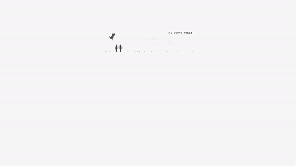
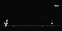

# T-RexRL

<p align="center">
    
</p>

# Introduction
This is [T-Rex Runner](http://www.trex-game.skipser.com/)

## Agent
The agent is T-Rex

## Observation
This environment provides only visual observation

### Visual Observation


Shape: (64, 128, 2)  
(*Stack 2 capture screens)

## Action
Jump(1) or Duck(0)

## Reward
-1 if terminal else 0.1

# Installation
```cmd
git clone https://github.com/hyunho1027/T-RexRL
```

## Requirements
- Python 3.7
- Tensorflow 2.2
- image
- cv2
- pyautogui
- webbrowser

## Usage
```cmd
python main.py
```
